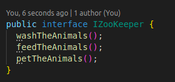
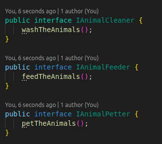
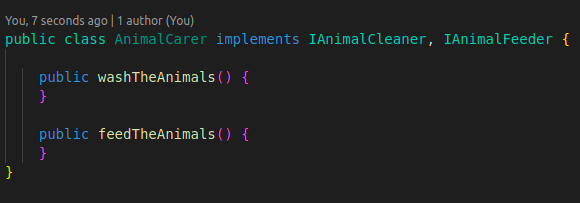
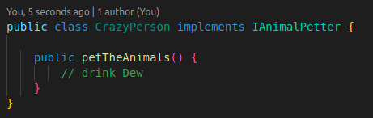
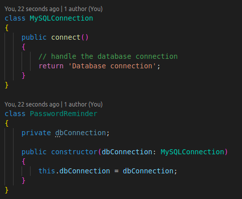
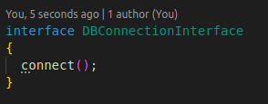
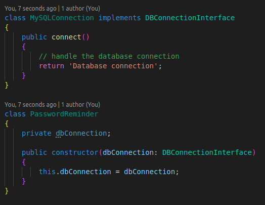

SOLID principles are the first five principles of object oriented design. Have you
ever faced scenarios where your file is just too long? Everything is in the same
place and it’s troublesome to debug? Mainly, the SOLID principles deal with how
code should be split up, which parts should be internal or exposed for other
services to use, and how code should use other code.
Why use SOLID principles?

The broad goal of the SOLID principles is to reduce dependencies so that
engineers change one area of software without impacting others. Additionally,
they’re intended to make designs easier to understand, maintain, and extend.
Ultimately, using these design principles makes it easier for software engineers to
avoid issues and to build adaptive, effective, and agile software.

There are five main principles related to it, which are described below.

1. Single Responsibility Principle
2. Open Closed Principle
3. Liskov Substitution Principle
4. Interface Segregation Principle
5. Dependency Inversion Principle1. Single Responsibility Principle

Each class should be responsible for a single part or functionality of the system.
It is a relatively basic principle that most developers are already utilizing to build
code. It can be applied to classes, software components, and microservices.
Utilizing this principle makes code easier to test and maintain, it makes software
easier to implement, and it helps to avoid unanticipated side-effects of future
changes.

```
class Book {
  String title;

  String author;

  String getTitle() {
    return title;
  }

  void setTitle(String title) {
    this.title = title;
  }

  String getAuthor() {
    return author;
  }

  void setAuthor(String author) {
    this.author = author;
  }

  void searchBook() {...}
}
```

Here, Book class get and set the title and also searches for the tille. It does two jobs.

## 1. Single responsibility principle implementation

```
class Book {
  String title;

  String author;

  String getTitle() {
    return title;
  }

  void setTitle(String title) {
    this.title = title;
  }

  String getAuthor() {
    return author;
  }

  void setAuthor(String author) {
    this.author = author;
  }
}
```

```
class InventoryView {
  Book book;

  InventoryView(Book book) {
    this.book = book;
  }

  void searchBook() {...}
}
```

## 2. Open Closed Principle

Software components should be open for extension, but not for modification.

```
class CookbookDiscount {
  String getCookbookDiscount() {
    String discount = "30% between Dec 1 and 24.";

    return discount;
  }
}

class DiscountManager {
  void processCookbookDiscount(CookbookDiscount discount) {...}
  }
```

```
class BiographyDiscount {
  String getBiographyDiscount() {
    String discount = "50% on the subject's birthday.";

    return discount;
  }
}
```

```
class DiscountManager {
  void processCookbookDiscount(CookbookDiscount discount) {...}
  void processBiographyDiscount(BiographyDiscount discount) {...}
}
```

The DiscountManager class should be changed to add another discount process which may not be fit for the other process using this class.After introducing abstract interface:

```
public interface BookDiscount {
  String getBookDiscount();
}

class CookbookDiscount implements BookDiscount {
  @Override
  public String getBookDiscount() {
    String discount = "30% between Dec 1 and 24.";

    return discount;
  }
}

class BiographyDiscount implements BookDiscount {
  @Override
  public String getBookDiscount() {
    String discount = "50% on the subject's birthday.";

    return discount;
  }
}
```

```
class DiscountManager {
  void processBookDiscount(BookDiscount discount) {...}
}
```

## 3. Liskov Substitution Principle

Objects of a superclass should be replaceable with objects of its subclasses without breaking the system.
Let us consider we have a bookstore. We have both the hardcover books as well as audiobooks that we sell. We can represent this using three classes: **BookDelivery**, **HardcoverDelivery**, and **AudiobookDelivery**. The latter two classes extend the BookDelivery class since it is possible to deliver a hardcover book or an audio book.

```
class BookDelivery {
  String titles;

  int userID;

  void getDeliveryLocations() {...}
}

class HardcoverDelivery extends BookDelivery {
  @Override
  void getDeliveryLocations() {...}
}

class AudiobookDelivery extends BookDelivery {
  @Override
  void getDeliveryLocations() {/* can't be implemented */}
}
```

However, we have a problem here. The base method getDeliveryLocations can be implemented by the class HardcoverDelivery but cannot be implemented by the **AudiobookDelivery** class - since we don’t have to physically deliver an audiobook. We can fix this by introducing another two classes: **OfflineDelivery** and **OnlineDelivery**. Both of these classes can extend the BookDelivery main class with their own base methods.

###### After refactoring:

```
class BookDelivery {
  String title;

  int userID;
}

class OfflineDelivery extends BookDelivery {
  void getDeliveryLocations() {...}
}

class OnlineDelivery extends BookDelivery {
  void getSoftwareOptions() {...}
}
```

Now, as per the Liskov Substitution principle, our application should run just as smoothly as it did previously; without breaking a sweat if we change our **HardcoverDevliery** and **AudiobookDelivery** classes to extend OfflineDelivery and **OnlineDelivery** classes.

The HardcoverDelivery class will extend OfflineDelivery class since hardcover books need to be physically transported. On the contrary, AudiobookDelivery class will extend OnlineDelivery since it can be electronically delivered through software applications.

```
class HardcoverDelivery extends OfflineDelivery {
  @Override
  void getDeliveryLocations() {...}
}

class AudiobookDelivery extends OnlineDelivery {
  @Override
  void getSoftwareOptions() {...}
}
```

## 4. Interface Segregation Principle

No client should be forced to depend on methods that it does not use. It means that larger interfaces should be split into smaller ones. By doing so, we can ensure that implementing classes only need to be concerned about the methods that are of interest to them.

Example:
Let us consider a class **AnimalCarer** which uses an interface called **IZooKeeper**. The interface has three methods to wash, feed and pet the animals which the AnimalCarer class implements.



As an AnimalCarer, we would want to wash and feed the animals, but to pet is too dangerous. Using this interface, our AnimalCarer class would have no choice but to pet the animals as well, which we may not always want.

We can fix this issue by segregating the interfaces like such: 



Now, we will be able to implement only the interfaces that are relevant to our class.



We can leave the **petTheAnimals** interface to its relevant class.



## 5. Dependency Inversion Principle

High-level modules should not depend on low-level modules, both should depend on abstractions. Classes should depend upon interfaces or abstract classes instead of concrete classes and functions.

Example:

Let’s consider a class which injects a database in it’s constructor.



Problem with this implementation is that, if we want to change the dbConnection from MySql to MongoDB, then we would need to edit the PasswordReminder class. This would violate the open-close principle and also every class that uses the MySQLConnection class needs to be updated.
\
The PasswordReminder class should not care what database our application uses.



Now, instead of directly type-hinting MySQLConnection in our PasswordReminder class, we should type-hint the DBConnectionInterface. This would mean that no matter the type of database our application uses, the PasswordReminder class would be able to connect to the database without changing the constructor and consequently not violating the Open-close principle.



##### References

* https://learning-notes.mistermicheels.com/architecture-design/oo-design/solid-pri
  nciples/
* https://www.digitalocean.com/community/conceptual_articles/s-o-l-i-d-the-first-fiv
  e-principles-of-object-oriented-design
* https://www.freecodecamp.org/news/solid-principles-explained-in-plain-english/
* https://raygun.com/blog/solid-design-principles/